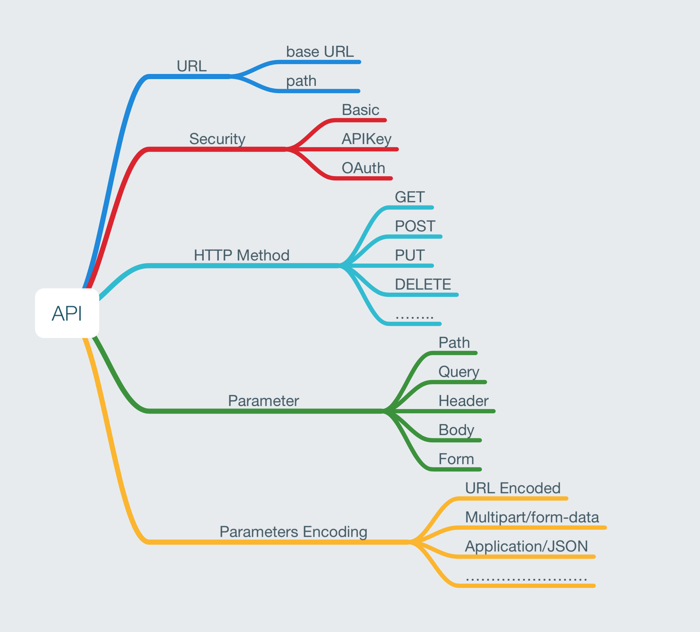

## [Slide](https://docs.google.com/presentation/d/1FVmWHkuJ8N8Y3O5nT9G7y_e7kzCacCEcqiH3NIJ7E_g/edit?usp=sharing)

## [Moya Github](https://github.com/Moya/Moya/)

## Usage
- [Basic](#setup-your-api-targets)
- [Custom Parameter Encoding](#custom-parameterencoding)
- [Authentication](#authentication)
- [Plugins](#plugins)

### Example
Please see code example here: [Moya Example](https://github.com/Innovatube/auth-moya-boilerplate)

#### Setup your API targets




First, create your targets file like `GithubTargets.swift`:

```ruby
struct GithubTargets {
    // Signup API
    struct Signup: APITargetType {

    }

    // Login API
    struct LoginTarget: APITargetType {

    }
}
```


Your API Target must conform `APITargetType`. This is composition protocol of Moya `TargetType` and `Authenticatable`:
```ruby
protocol APITargetType: TargetType, Authenticatable {

}
```

Then add your API's information:

#### 1. API Base URL:

```ruby
struct GithubTargets {

    struct Login: APITargetType {
        let baseURL: URL = URL(string: "http://github.com/api/v1")!
    }
}
```

This URL can be share between Targets by using protocol extension for `APITargetType`:

```ruby
extension APITargetType {
    var baseURL: URL {
        return URL(string: "http://github.com/api/v1")!
    }
}
```

If you're using more than one API base URL, separate them out into separate Targets.


#### 2.Path:

```ruby
struct GithubTargets {

    struct Login: APITargetType {
        let baseURL: URL = URL(string: "http://github.com/api/v1")!
        let path: String = "/login"
    }
}
```


#### 3.HTTP Method:

```ruby
struct GithubTargets {

    struct Login: APITargetType {
        let baseURL: URL = URL(string: "http://github.com/api/v1")!
        let path: String = "/login"

        let method: Moya.Method = .get
    }
}
```


#### 4. Task:
Represents how you are sending / receiving data. This can be either `.request, .upload or .download`, and allows you to add data, files and streams to the request body.
```ruby
struct GithubTargets {

    struct Login: APITargetType {
        //...
        let task: Task = .request
    }
}
```


#### 5.  Parameters:
Add your API parameters as Struct's properties so you can create Target easily by Struct initializer:

```ruby
struct GithubTargets {

    struct Login: APITargetType {
        let baseURL: URL = URL(string: "http://github.com/api/v1")!
        let path: String = "/login"
        let method: Moya.Method = .get

        let username: String
        let password: String

        var parameters: Parameter? {
            var params = Parameter()

            params["user_name"] = username
            params["password"] = password

            return params
        }
    }
}
```

Parameter is typealias of Dictionary [String: Any]. If you don't have any parameters, return `nil` would work.


#### 6.Parameter Encoding:
This indicate how we want our parameters to be encoded into our request. Moya has `URLEncoding`, `JSONEncoding`, and `PropertyListEncoding` or you can create your custom ParameterEncoding that conform to `ParameterEncoding` (see [CompositeEncoding](#custom-parameterencoding)):

```ruby
struct GithubTargets {

    struct Login: APITargetType {
        //...
        let parameterEncoding: ParameterEncoding = JSONEncoding.default
    }

    struct Signup: APITargetType {
        //...
        let parameterEncoding: ParameterEncoding = URLEncoding.default
    }
}
```

Normally, you will use one type of ParameterEncoding at once, so you can add default encoding by using extension:
```ruby
extension APITargetType {
    var parameterEncoding: Parameter {
        // Your default parameterEncoding here
        return JSONEncoding.default
    }
}
```


#### 7.Authentication:
Set your authentication method. Currently, our API template only support `Basic` and `OAuth2 (flow: password)`. See more([Authentication](https://github.com/Moya/Moya/blob/master/docs/Authentication.md) )
```ruby
struct GithubTargets {

    struct Login: APITargetType {
        //...
        let authentication: Authentication = .oauth2

    }
}
```


#### 8.Sample Data:
This can be used later for tests or for providing offline support for developers. If you don't write unit test, simply return empty data:

```ruby
struct GithubTargets {

    struct Login: APITargetType {
        //...
        let sampleData: Data = Data()
    }
}
```


## Custom ParameterEncoding
This is custom Moya implementation to use with Swagger Codegen.

Moya only support single type of parameter encoding in per API but you can create custom ParameterEncoding to support many parameter type with different encoding type. In case your API has different encode type, you need to create custom `ParameterEncoding` and conform to `ParameterEncoding`.

We already created `CompositeEncoding` which will fit almost case (see detail implementation [CompositeEncoding](https://CompositeEncoding.swift))

#### Usage:
You need to set your parameters by using `CompositeParameters` and don't forget to convert it to `Moya.Parameters` with `toParameters` function:

```ruby
struct GithubTargets {

    struct UpdateProfile: APITargetType {
        let baseURL: URL = URL(string: "https://api.twitter.com/v1")!
        let path: String = "/account/update_profile"
        let method: Moya.Method = .post

        let title: String
        let email: String
        let status: String

        var parameters: Parameter? {
            var compositeParameters = CompositeParameters()

            var queryParameters = Parameter()
            queryParameters["title"] = title
            queryParameters["status"] = status

            var formParameters = Parameter()
            formParameters["email"] = email

            // Add more type of parameters here

            compositeParameters.header = headerParameters
            compositeParameters.form = formParameters

            // Finally
            return compositeParameters.toParameters()
        }
    }
}
```

Then override your custom ParameterEncoding:

```ruby
struct GithubTargets {

    struct UpdateProfile: APITargetType {
        let baseURL: URL = URL(string: "https://api.twitter.com/v1")!
        let path: String = "/account/update_profile"
        let method: Moya.Method = .post

        //...
        let parameterEncoding = CompositeEncoding()
    }
}
```

This part will be automatic generate by using Swagger Codegen.

## Authentication


## Plugins
